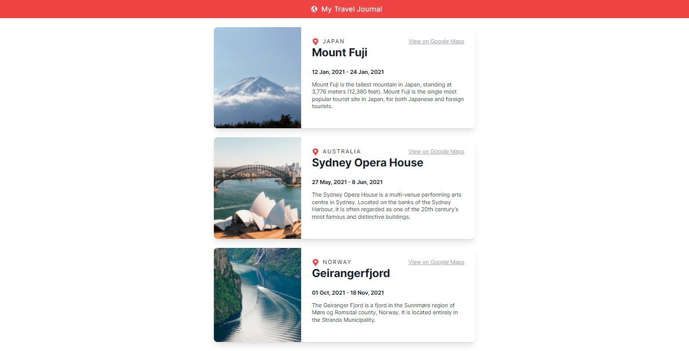

<!-- Please update value in the {}  -->

<h1 align="center">Travel Journal</h1>

<!-- TABLE OF CONTENTS -->

## Table of Contents

- [Overview](#overview)
  - [Built With](#built-with)
- [How to use](#how-to-use)
- [Acknowledgements](#acknowledgements)
- [Contact](#contact)

<!-- OVERVIEW -->

## Overview



### Built With

<!-- This section should list any major frameworks that you built your project using. Here are a few examples.-->

- [React](https://reactjs.org/)
- [Tailwind](https://tailwindcss.com/)

## How To Use

<!-- This is an example, please update according to your application -->

To clone and run this application, you'll need [Git](https://git-scm.com) and [Node.js](https://nodejs.org/en/download/) (which comes with [npm](http://npmjs.com)) installed on your computer. From your command line:

```bash
# Clone this repository
$ git clone https://github.com/sayyedulawwab/travel-journal.git

# Install dependencies
$ npm install

# Run the app
$ npm start
```

## Acknowledgements

- [Node.js](https://nodejs.org/)
- [React](https://reactjs.org/)

## Contact

- GitHub [@sayyedulawwab](https://github.com/sayyedulawwab)
- LinkedIn [@sayyedulawwab](https://www.linkedin.com/in/sayyedulawwab/)
